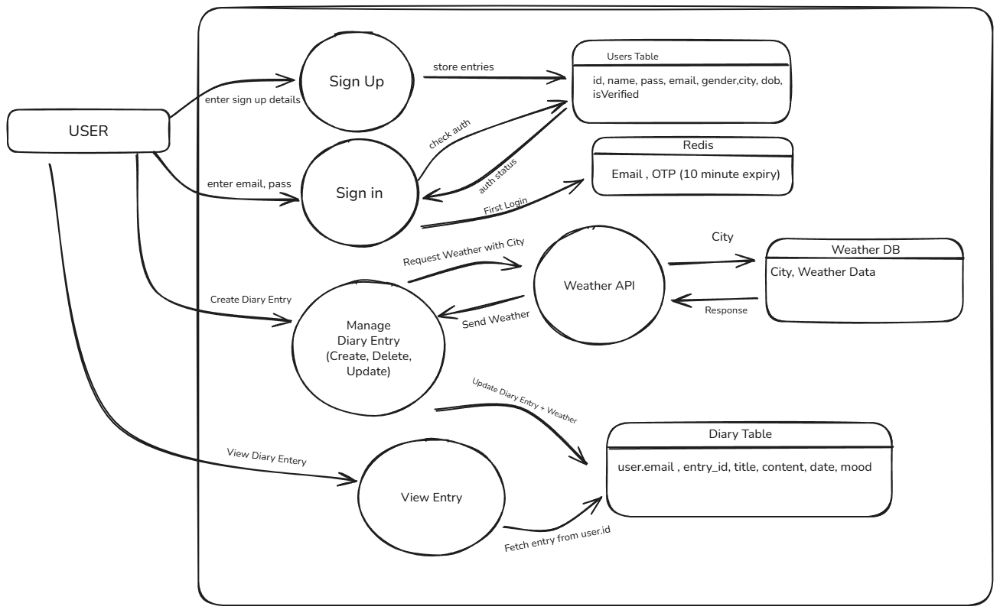

# 📔 InKeep | Your Digital Diary

InKeep is a fullstack web application designed to help users securely write, save, and manage personal diary entries. Built with a React frontend and Spring Boot backend.

## 🧱 Tech Stack

| Layer     | Technology                   |
| --------- | ---------------------------- |
| Frontend  | React, Vite                  |
| Backend   | Spring Boot, Java 24         |
| Database  | MySQL                        |
| OTP Store | Upstash Redis                |
| Email     | Brevo (Sendinblue)           |
| Auth      | Spring Security, OTP (Email) |
| Deploy    | Railways, Jenkins CI/CD, AWS |

## 📸 Data Flow Diagram (Overview)



## 🚀 Getting Started

### 🔧 Prerequisites

- Java 24
- Node.js 18+
- Maven
- Vite
- Git

## 📦 Installation & Setup

### 1. Clone the Repository

```bash
git clone https://github.com/himanshupapola/InKeep.git
cd InKeep
```

### 2. Backend Setup (Spring Boot)

```bash
cd backend
configure .env file
Run main file
```

### 3. Frontend Setup (React + Vite)

```bash
cd ../frontend
npm install
configure .env file
npm run dev
```

## 🛡️ Environment Variables

### 1. Frontend (frontend/.env)

```bash
VITE_API_URL=your_backend_url
VITE_OPENWEATHER_API_KEY=your_openweather_key
VITE_GEONAMES_USERNAME=your_geonames.org_name
```

### 2. Backend (backend/.env)

```bash
DB_URL=your_sql_server_url
DB_USERNAME=your_db_user
DB_PASSWORD=your_db_password
BREVO_API_KEY=your_brevo_key
REDIS_URL=your_upstash_url
REDIS_TOKEN=your_redis_token
```

## ✨ Features

📝 Create, edit, and delete diary entries

🔐 End-to-End Encryption (AES) with client-side passphrase

📧 OTP Verification with Brevo

📅 Calendar-based entry filtering

🌥️ Weather Updates

## 🔮 Future Scope

- 🌐 Community Section
- 📊 Better visulization of data
- 📤 PDF export and backup to cloud storage
- 🧠 AI-based sentiment analysis of diary entries


## ⛳️ Live Preview

- Railways - [`🚀 Click to Visit`][frontend-link]

[frontend-link]: https://inkeep-production.up.railway.app/
